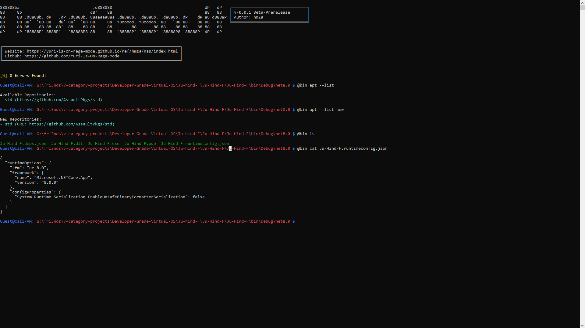

# NovaAssault xVin
### **Is A New Type Of Shell**

> A customizable shell that functions as both a programming language and a Bash terminal, built with Vin Virtual OS.

</img>

### 🌟 Overview
Welcome to the **NovaAssault Shell**—where power meets customization! This innovative shell environment brilliantly merges the capabilities of a programming language with the flexibility of a Bash terminal. Built on the cutting-edge [weapons-grade-virtual-machine](https://github.com/Yuri-Is-On-Rage-Mode/weapons-grade-virtual-machine) VM, NovaAssault Shell delivers a dynamic platform for both scripting and command execution. 🚀💻

### 🔑 Key Features
- **Dual Functionality:** Combines the roles of a programming language and a terminal. Get ready for versatile scripting, seamless automation, and direct command execution! 🎉
- **Built on Vin:** Harness the power of the advanced Vin Virtual Computer VM for a robust virtual computing experience. 
  > **No Vin? No Problem!** You can still rock this shell without it! 😎
- **Highly Customizable:** Tailor the shell to fit your unique needs with extensive customization options—boost your productivity and streamline your workflow! 💪✨
- **User-Friendly Interface:** Experience a perfect blend of advanced features and an intuitive interface, making it accessible for newbies and seasoned pros alike! 🧑‍💻👩‍💻
